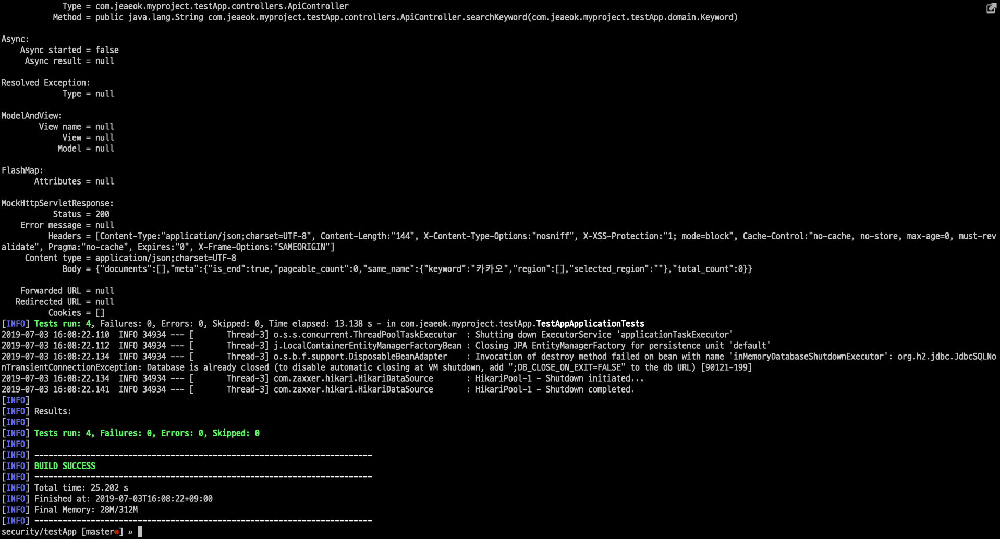
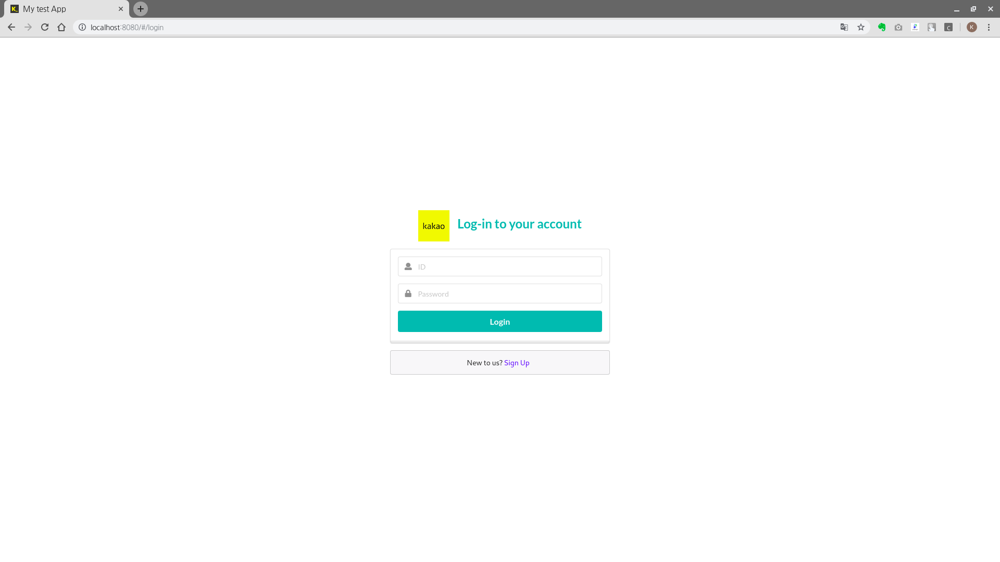
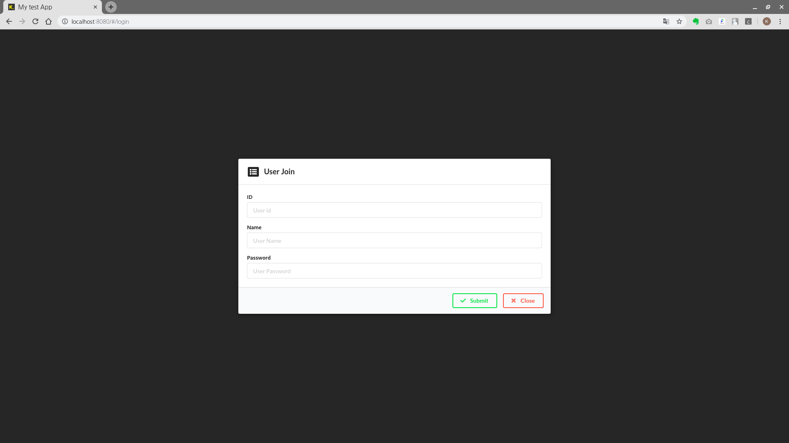
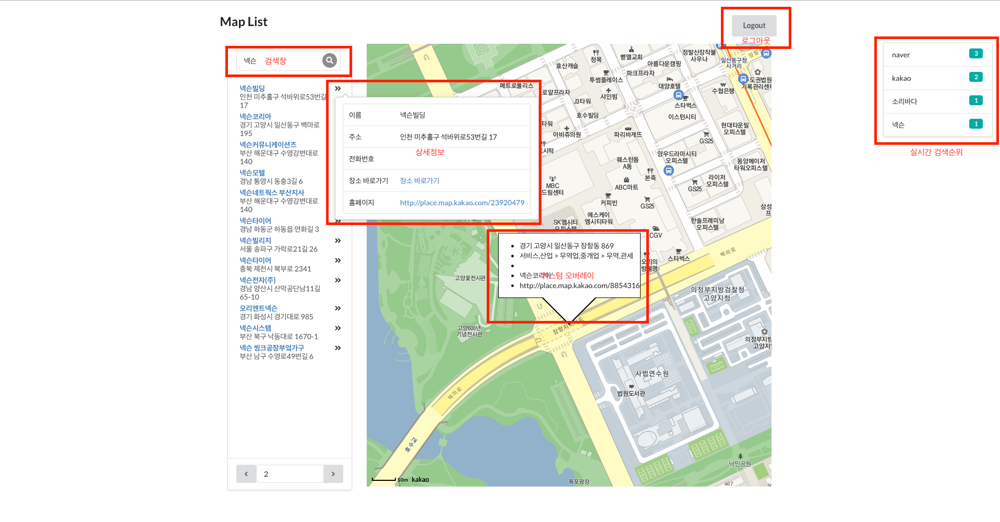
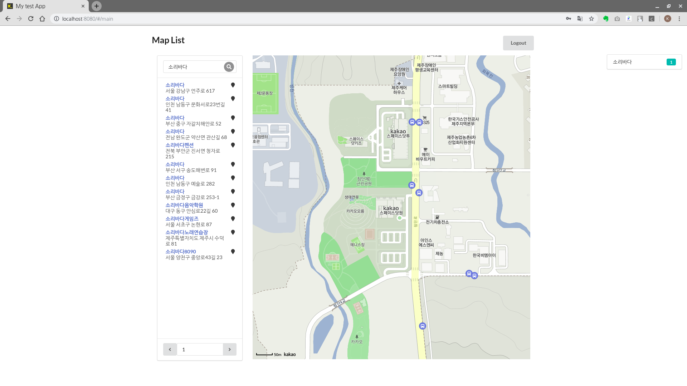
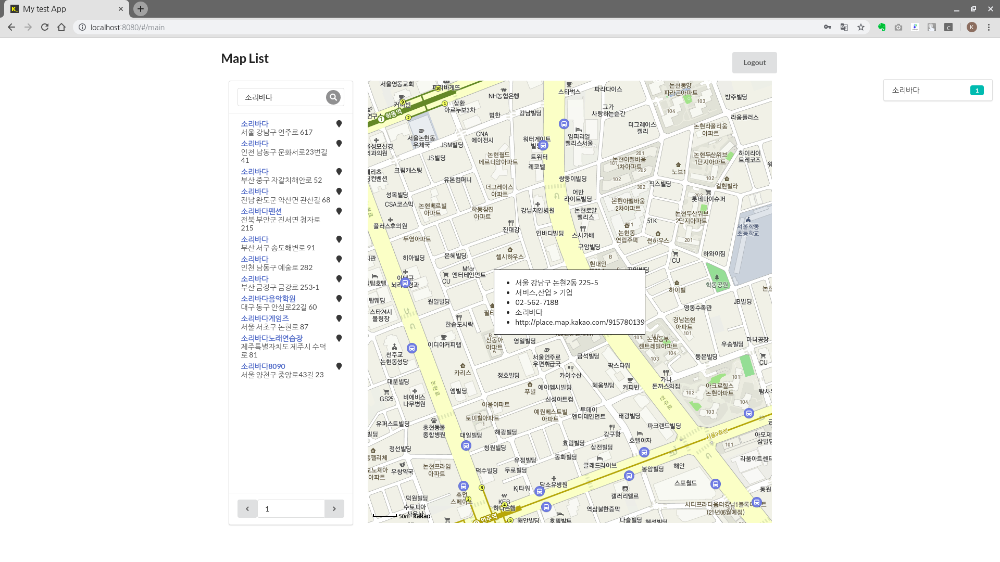
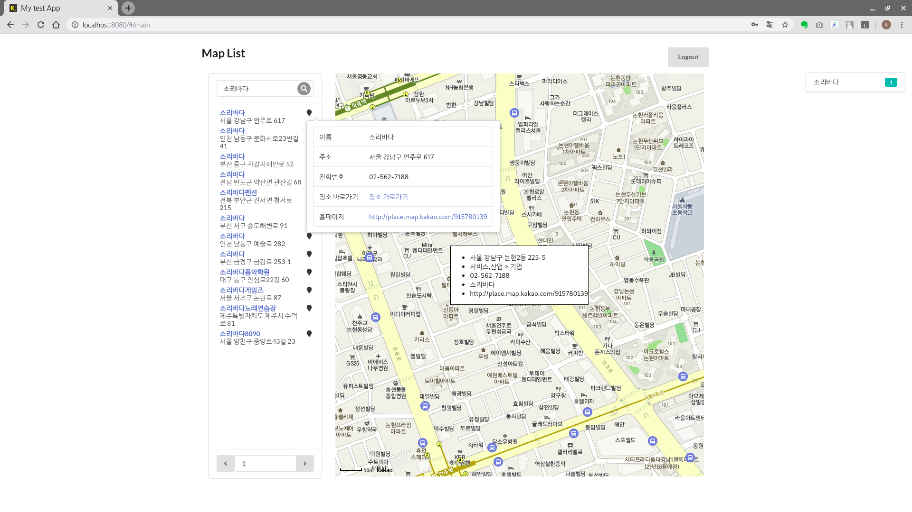

# 개인 프로젝트

## 프로젝트 설명
 - 웹 api 을 이용한 웹 에플리케이션으로써 기능은 다음과 같습니다.
    1. 사용자 추가 및 인증
    2. 지도정보를 통하여 장소검색 및 상세조회
    3. 검색된 데이터는 페이징으로 조회
    4. 과거 검색이력 조회
    5. 실시간 검색순위 확인


## 사용한 라이브러리
- Spring Boot : 백엔드 서버 구성
- Spring Security : 로그인 처리 및 API 서버 통신 인증용
- Spring Data JPA : ORM을 활용한 데이터 베이스 제어
- React.js : 프론트 엔드
- lodash : json 데이터 수정 및 제어
- Semantic UI React : 화면 구성 라이브러리
- React Table : rest api 에서 받은 데이터를 통하여 그리드 구성

## 개발서버 구동
 - application.yml 을 열고 kakao 항목에 api_key 부분을 수정합니다.

```yml
kakao:
  local_api_url: https://dapi.kakao.com/v2/local/search/keyword.json
  api_key: <KAKAO API KEYS>
```

- testApp 폴더에서 다음 명령어를 실행
```shell
$ mvn spring-boot:run
```
- front-end/ 폴더에서 다음 명령어를 실행
```shell
$ npm install
$ npm start
```
-  자동으로 인메모리에 계정정보가 입력이 되며 계정정보는 다음과 같습니다.<br>
id : test1, pwd : 1234<br>
id : test2, pwd : 1234<br>
id : test3, pwd : 1234<br>

## 테스트 절차
1. testApp 폴더 내부에 다음 명령어 입력
```shell
$ mvn test
```


2. testApp/front-end 폴더 내부에 다음 명령어를 입력
```shell
$ npm test
```


## 빌드 방법
1. front-end 폴더로 이동하여 다음 명령어를 실행합니다.
```shell
$ npm run build
```

2. front-end/build 폴더안의 있는 html 파일을 src/resource/templates 폴더에 삽입

3. front-end/build/static 폴더를 src/resource/static 에 복사.

4. testApp 폴더에서 다음 명령어를 실행
```shell
$ mvn clean package
```

## 동작 및 기능

- 로그인 화면


- 회원가입창


- 기본적인 화면내용


- 지도 검색화면


- 지도 검색 결과에서 이미지 클릭시 지도상으로 커스텀 오버레이 표시


- 마우스 오버시 상세정보가 출력되며 지도상세보기 링크 활성화


